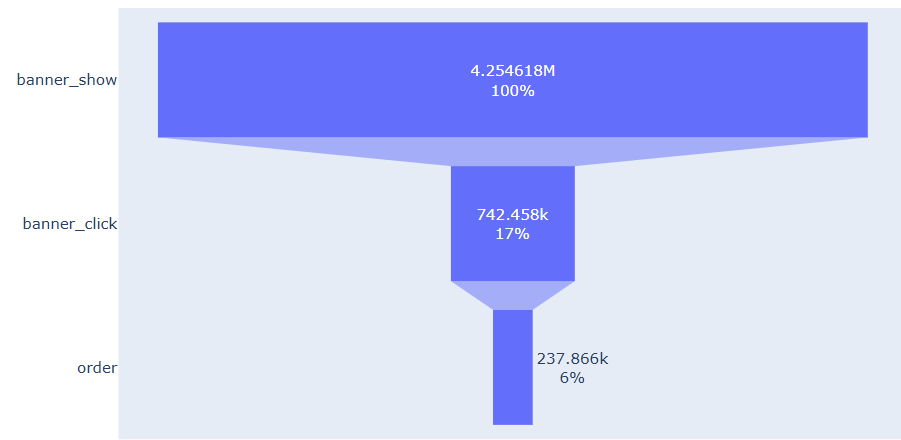
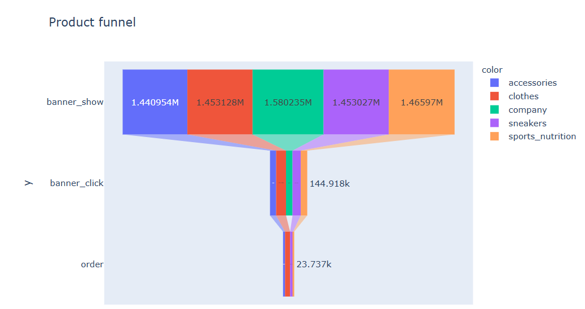
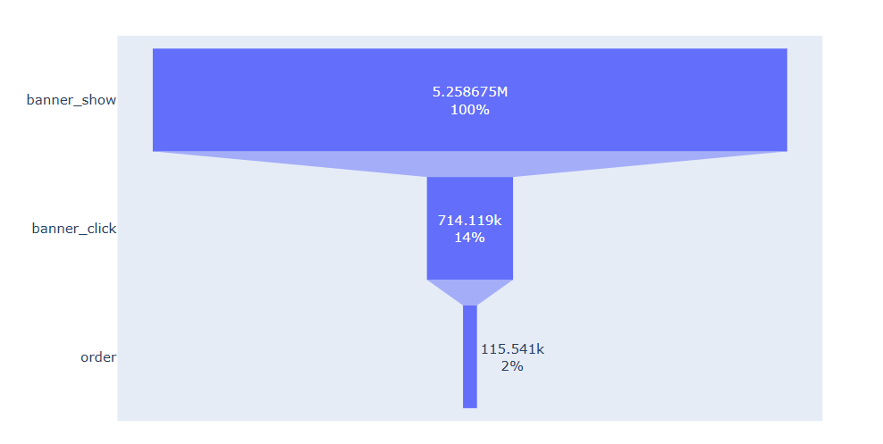
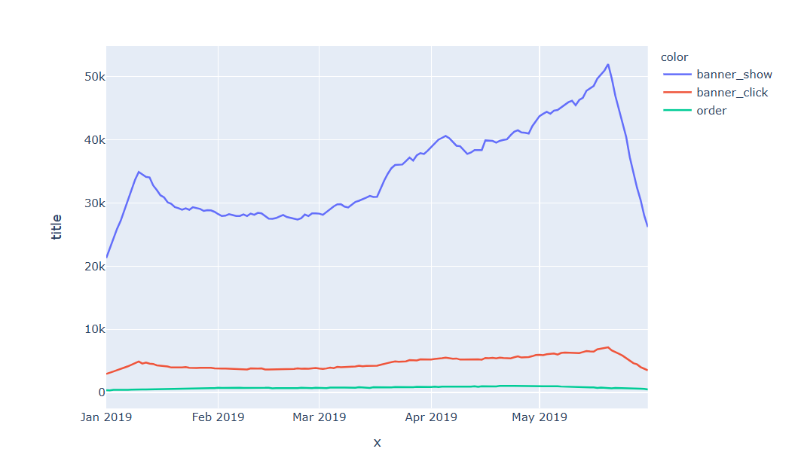

- The dataset contains approximately 8.47 million rows and 8 columns, including user identifiers, product information, site version, interaction time, page title, and a binary target variable.
### 📊 Site Funnel Analysis

- The site funnel shows a 17% conversion from product show to click, 32% from click to order, and an overall 5.6% conversion from show to order.
  
### 📊 Product wise Site Funnel Analysis
- 

### 📊 Mobile users analytics
MOBILE SITE FUNNEL 
- 
- We have 14% conversion from show to click, 16.2% conversion from click to order and 2.2% from show to order.

Seasonality trend 
  - 
  - This is a line through the all time, there are some repeating ups and downs for banner_click and order.

