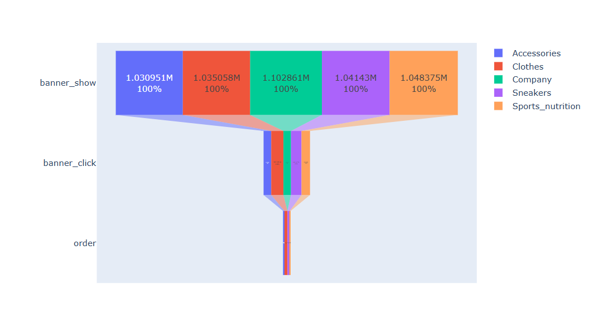
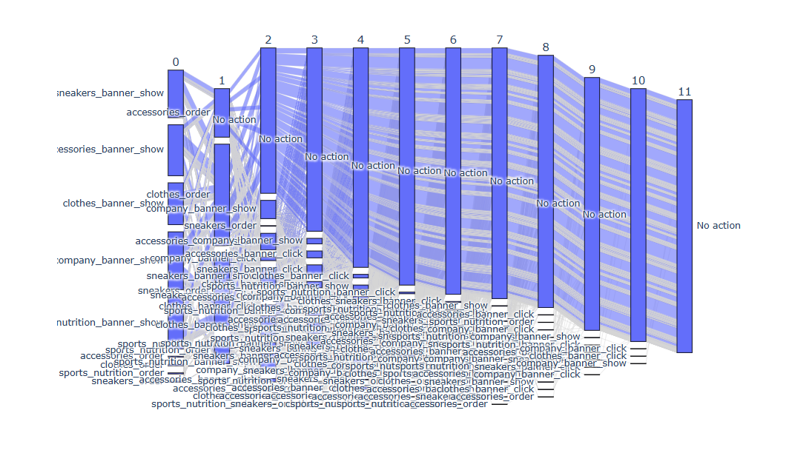
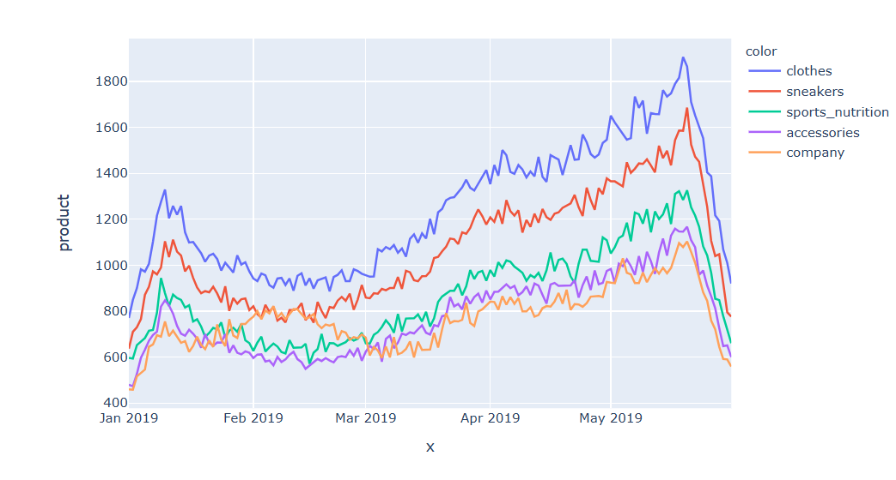

- The dataset contains approximately 8.47 million rows and 8 columns, including user identifiers, product information, site version, interaction time, page title, and a binary target variable.
### 📊 Site Funnel Analysis

- The site funnel shows a 17% conversion from product show to click, 32% from click to order, and an overall 5.6% conversion from show to order.
### 📊 Product wise Site Funnel Analysis
- 
### 📊 Mobile users analytics

MOBILE SITE FUNNEL 
 
- We have 14% conversion from show to click, 16.2% conversion from click to order and 2.2% from show to order.
  
Seasonality trend 
   
  - This is a line through the all time, there are some repeating ups and downs for banner_click and order.

## 📊 Funnel Insights (Mobile Users)

- **Clothing banners** show the strongest performance for mobile users, with the highest click-through rates and a **24.4% click-to-order conversion**, indicating strong demand and well-aligned banner messaging with user expectations.

- **Sneaker banners** perform moderately well, remaining clickable but with lower effectiveness compared to clothing, achieving a **21.8% click-to-order conversion** and an overall **2.8% conversion to order**.

- **Sports nutrition banners** demonstrate a relatively high macro-conversion rate (**13%**), but suffer from a low **click-to-order conversion (9.3%)**, suggesting potential issues such as:
  - Broken or misdirected banner links  
  - Misalignment between banner messaging and landing page content  
  - Insufficient product information on the site  
  - Stronger competitive offerings in terms of price, quality, or assortment  

- **Accessories banners** have lower click-through rates (**11%**) but show strong post-click performance with a **19.1% click-to-order conversion**, indicating an opportunity to increase sales by improving banner visibility and attractiveness.

- **Company-related banners** show the lowest engagement among mobile users, suggesting limited effectiveness for direct conversion-driven campaigns.

## ⏱ Time-Based Banner Performance Insights

- All banner categories were displayed across similar time periods, allowing for a fair comparison of user engagement and conversion behavior.

- **Clothing banners** receive the highest click activity during **7–9 a.m.**, while orders are consistently placed throughout the day, primarily from **10 a.m. to midnight**.

- **Sneaker banners** follow a similar pattern, with peak click activity in the **7–9 a.m.** window and steady order placements during later hours.

- **Accessories banners** generate fewer clicks overall, with peak engagement occurring during **7–9 a.m.**; however, most purchases occur during daytime hours (**11 a.m.–8 p.m.**).

- **Sports nutrition banners** show limited click activity, peaking during **7–9 a.m.**, while orders are primarily concentrated during **11 a.m.–8 p.m.**, indicating delayed conversion behavior.

- The majority of first-time orders—primarily for clothing, followed by sneakers and accessories—occur after users view company-related banners; however, most users do not take further actions after completing their first purchase.

- Click activity on company-related banners shows a sharp increase from **January 20 to February 17**, after which it follows a trend similar to other banner categories.

- Across all product banners, a recurring **weekly seasonal pattern** is observed: click activity increases at the start of the week, declines mid-week, rises again around Thursday, and decreases during weekends and holidays.

